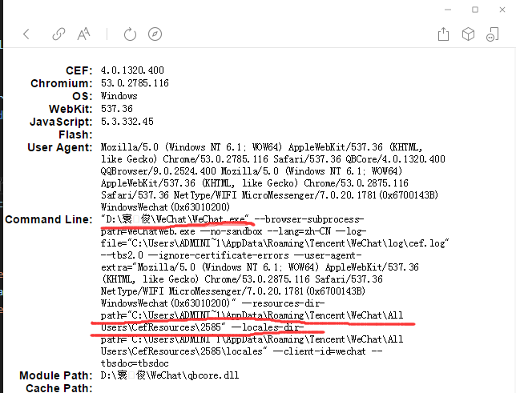
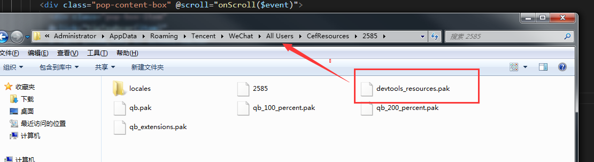
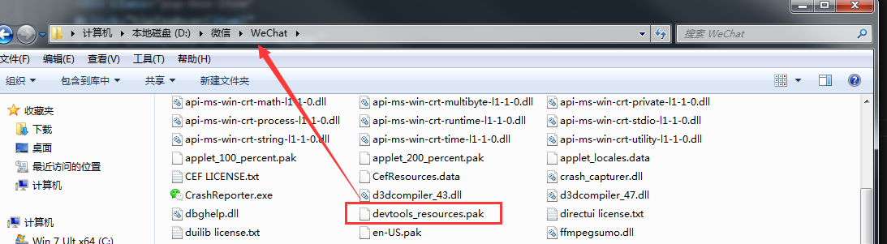
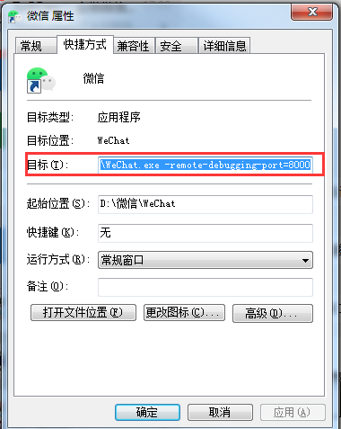

### 微信客户端版本在3.2及以下此方法才有效(亲测3.2版本可以)，3.2版本后微信内置浏览器内核进行了升级。

## 步骤1 - 查看微信内置浏览器版本并记录相关文件的位置
将该链接复制进微信点击，`https://wuchendi.gitee.io/chrome/index.html`

<i>图1-当前微信浏览器内置版本信息</i>

## 步骤2 - 下载 `devtools_resources.pak`文件
将下载的文件分别放入上面的位置，`--resources-dir-path`和`安装目录中`， ``由于版本的区别，需要下载对应版本的devtools_resources.pak``

**devtools_resources.pak下载地址**

链接：[https://pan.baidu.com/s/1Fh22YJv_XBoqBQ5wioqX-g](https://pan.baidu.com/s/1Fh22YJv_XBoqBQ5wioqX-g)
 
提取码：kecs

<i>图2-需要放的目录1</i>

 

<i>图3-需要放的目录2</i>

## 步骤3 - 配置微信启动参数
在微信快捷方式，右键点击属性，目前后面增加 `-remote-debugging-port=8000`

<i>图4-配置微信启动参数</i>

## 步骤4 - 重启微信即可
